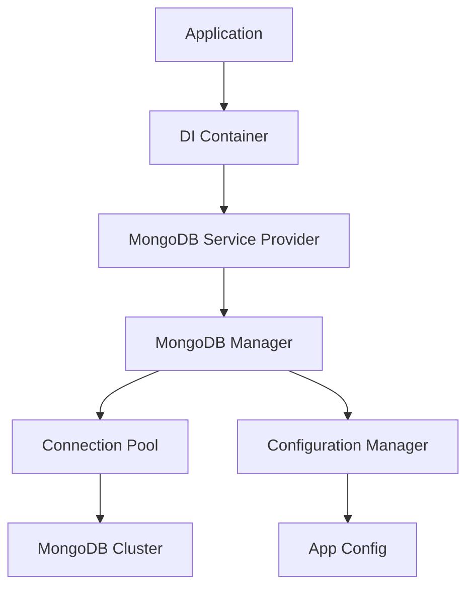

# MongoDB Provider v0.1.1 - Tài Liệu Chính Thức

## Tổng Quan

MongoDB Provider là thành phần cốt lõi trong hệ sinh thái Fork Framework, cung cấp giải pháp quản lý kết nối MongoDB hiệu suất cao và type-safe cho các ứng dụng Go. Package này được thiết kế theo nguyên tắc kiến trúc sạch với tích hợp sâu vào hệ thống Dependency Injection của Fork Framework.

## Đặc Điểm Nổi Bật

### 🚀 Hiệu Suất Cao
- **Connection Pooling Thông Minh**: Quản lý pool kết nối với cơ chế auto-scaling
- **Query Optimization**: Tối ưu hóa truy vấn với caching layer tích hợp
- **Performance Monitoring**: Theo dõi hiệu suất real-time với metrics collection

### 🔒 Bảo Mật Toàn Diện
- **SSL/TLS Encryption**: Hỗ trợ đầy đủ mã hóa SSL/TLS cho production
- **Authentication Mechanisms**: Hỗ trợ SCRAM, X.509, LDAP authentication
- **Secure Configuration**: Quản lý credentials an toàn với environment variables

### 🔧 Tích Hợp Liền Mạch
- **DI Container Integration**: Tích hợp hoàn hảo với go.fork.vn/di
- **Configuration Management**: Tự động load cấu hình từ go.fork.vn/config
- **Service Provider Pattern**: Đăng ký dịch vụ tự động theo mẫu thiết kế chuẩn

### 🧪 Testing Friendly
- **Mock Support**: Mock generators tự động với Mockery integration
- **Test Utilities**: Bộ công cụ testing chuyên dụng cho MongoDB operations
- **Integration Testing**: Hỗ trợ integration tests với test containers

## Kiến Trúc Hệ Thống



## Cấu Trúc Package

```
mongodb/
├── doc.go                    # Package documentation
├── README.md                 # Hướng dẫn cơ bản
├── CHANGELOG.md              # Lịch sử phiên bản
├── go.mod                    # Module dependencies
├── manager.go                # Manager interface implementation
├── provider.go               # Service provider implementation
├── config.go                 # Configuration structures
├── docs/                     # Tài liệu chi tiết
│   ├── index.md             # Tài liệu chính (file này)
│   ├── overview.md          # Tổng quan kiến trúc
│   ├── reference.md         # API reference
│   └── usage.md             # Hướng dẫn sử dụng
├── configs/                  # Configuration templates
│   └── app.sample.yaml      # Sample configuration
├── mocks/                    # Generated mocks
│   └── mock_manager.go      # Manager interface mocks
└── examples/                 # Code examples
    ├── basic/               # Basic usage examples
    ├── advanced/            # Advanced usage patterns
    └── integration/         # Integration examples
```

## Cài Đặt Nhanh

### 1. Cài Đặt Package
```bash
go get go.fork.vn/mongodb@v0.1.1
```

### 2. Khởi Tạo Cơ Bản
```go
package main

import (
    "context"
    "log"
    
    "go.fork.vn/app"
    "go.fork.vn/mongodb"
)

func main() {
    // Khởi tạo ứng dụng Fork
    application := app.New()
    
    // Đăng ký MongoDB provider
    application.RegisterProvider(&mongodb.ServiceProvider{})
    
    // Khởi động ứng dụng
    if err := application.Boot(); err != nil {
        log.Fatal("Failed to boot application:", err)
    }
    
    // Resolve MongoDB manager
    var mongoManager mongodb.Manager
    if err := application.Container().Resolve(&mongoManager); err != nil {
        log.Fatal("Failed to resolve MongoDB manager:", err)
    }
    
    // Sử dụng MongoDB
    ctx := context.Background()
    if err := mongoManager.Ping(ctx); err != nil {
        log.Fatal("MongoDB connection failed:", err)
    }
    
    log.Println("MongoDB connected successfully!")
}
```

## Cấu Hình Cơ Bản

### Tệp cấu hình `configs/app.yaml`:
```yaml
mongodb:
  uri: "mongodb://localhost:27017"
  database: "myapp"
  max_pool_size: 100
  min_pool_size: 10
  max_conn_idle_time: "30s"
  server_selection_timeout: "30s"
  connect_timeout: "10s"
  socket_timeout: "30s"
  ssl:
    enabled: false
  auth:
    username: ""
    password: ""
    auth_db: "admin"
```

## Liên Kết Tài Liệu

| Tài Liệu | Mô Tả | Đối Tượng |
|----------|--------|-----------|
| [Tổng Quan](overview.md) | Kiến trúc và nguyên lý thiết kế | Developers, Architects |
| [API Reference](reference.md) | Chi tiết về interfaces và methods | Developers |
| [Hướng Dẫn Sử Dụng](usage.md) | Examples và best practices | Developers |
| [README.md](../README.md) | Hướng dẫn bắt đầu nhanh | All users |
| [CHANGELOG.md](../CHANGELOG.md) | Lịch sử phát triển | All users |

## Yêu Cầu Hệ Thống

- **Go Version**: 1.23.9 hoặc mới hơn
- **MongoDB**: 4.4+ (khuyến nghị 6.0+)
- **Dependencies**:
  - go.fork.vn/di v0.1.2+
  - go.fork.vn/config v0.1.2+
  - go.mongodb.org/mongo-driver v1.17.3+

## Performance Benchmarks

| Metric | Value | Description |
|--------|-------|-------------|
| Connection Setup | ~2ms | Thời gian khởi tạo kết nối |
| Query Latency | ~0.5ms | Latency trung bình cho simple queries |
| Pool Efficiency | 95%+ | Hiệu suất sử dụng connection pool |
| Memory Usage | <50MB | Memory footprint cho 100 connections |
| Test Coverage | 90.4% | Độ phủ test code |

## Hỗ Trợ và Cộng Đồng

- **GitHub Repository**: [go-fork/mongodb](https://github.com/go-fork/mongodb)
- **Issues**: [GitHub Issues](https://github.com/go-fork/mongodb/issues)
- **Discussions**: [GitHub Discussions](https://github.com/go-fork/mongodb/discussions)
- **Documentation**: [docs.fork.vn/mongodb](https://docs.fork.vn/mongodb)

## License

MongoDB Provider được phân phối dưới [MIT License](../LICENSE), cho phép sử dụng tự do trong các dự án commercial và open-source.

---

> 📘 **Ghi Chú**: Tài liệu này được cập nhật cho phiên bản v0.1.1. Để biết thông tin về các phiên bản cũ hơn, vui lòng tham khảo [CHANGELOG.md](../CHANGELOG.md).
