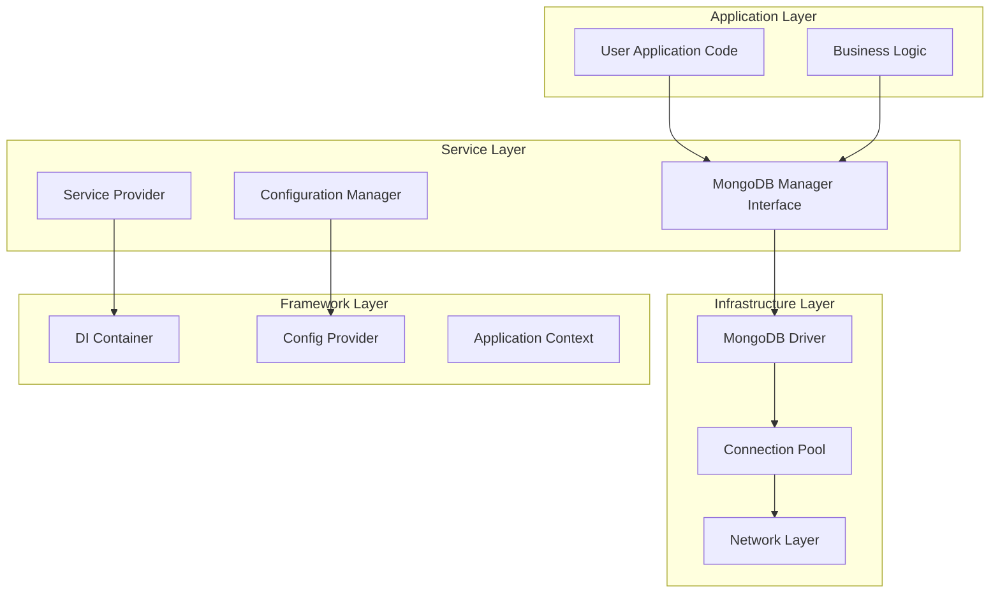
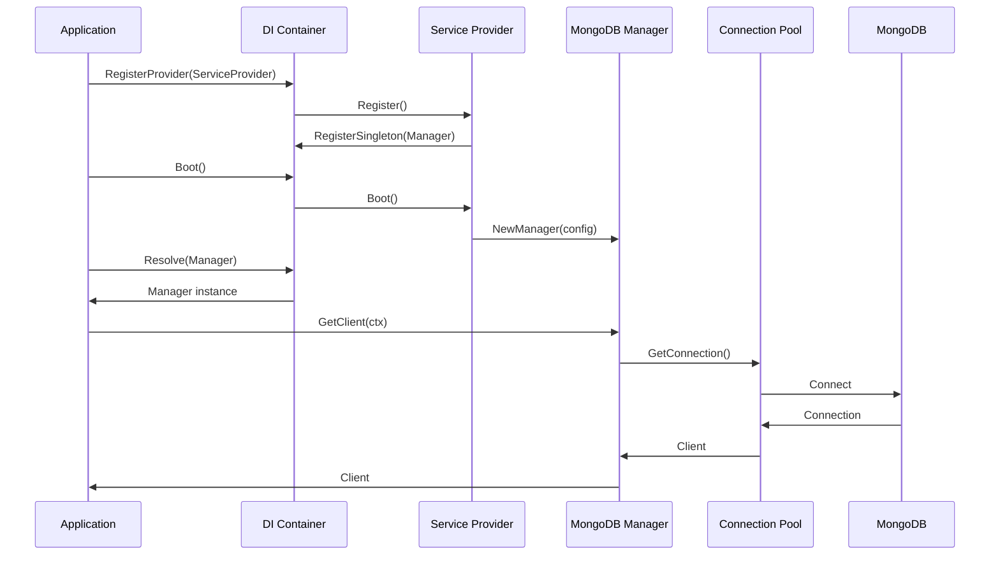
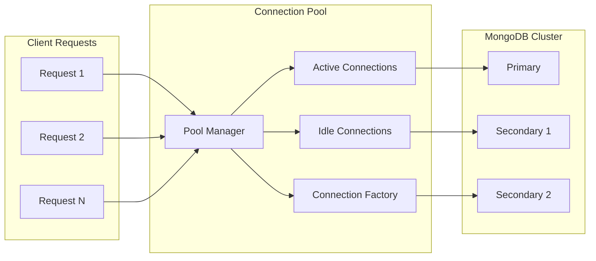
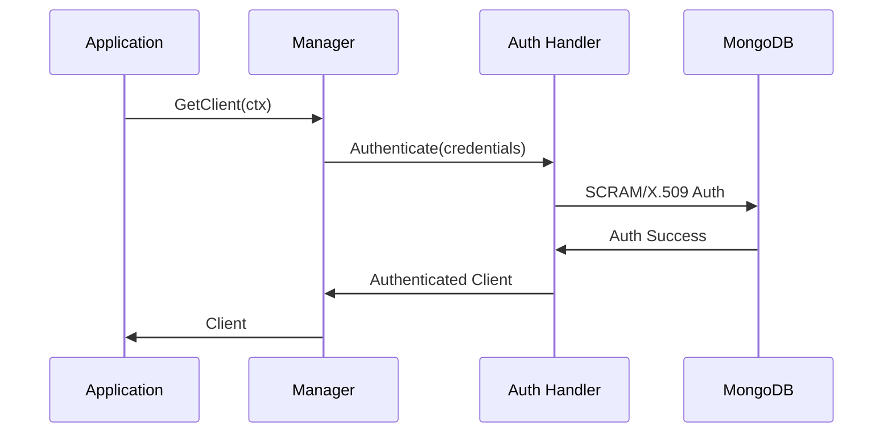

# Tổng Quan Kiến Trúc MongoDB Provider v0.1.1

## Nguyên Lý Thiết Kế

MongoDB Provider được xây dựng dựa trên các nguyên tắc kiến trúc sạch và design patterns proven của Laravel, nhưng được điều chỉnh để phù hợp với idioms của Go và đặc thù của MongoDB ecosystem.

### Nguyên Tắc Cốt Lõi

#### 1. **Interface-First Design**
Toàn bộ package được thiết kế xung quanh interfaces, đảm bảo:
- **Loose Coupling**: Các component độc lập với concrete implementations
- **Testability**: Dễ dàng mock và unit test
- **Extensibility**: Có thể extend functionality mà không breaking changes

#### 2. **Dependency Injection**
Sử dụng DI container để:
- **Service Registration**: Đăng ký services theo lifecycle phù hợp
- **Automatic Resolution**: Tự động resolve dependencies
- **Configuration Injection**: Inject configuration thông qua DI

#### 3. **Single Responsibility**
Mỗi component có trách nhiệm rõ ràng:
- **Manager**: Quản lý MongoDB connections và operations
- **ServiceProvider**: Đăng ký và configure services
- **Config**: Quản lý configuration và validation

## Kiến Trúc Layered

### Layer Architecture



### Component Interaction



## Core Components

### 1. Manager Interface

Manager là interface chính cung cấp tất cả operations với MongoDB:

```go
type Manager interface {
    // Connection Management
    GetClient(ctx context.Context) (*mongo.Client, error)
    GetDatabase(ctx context.Context, name string) (*mongo.Database, error)
    GetCollection(ctx context.Context, database, collection string) (*mongo.Collection, error)
    
    // Health & Status
    Ping(ctx context.Context) error
    IsConnected(ctx context.Context) bool
    
    // Lifecycle
    Disconnect(ctx context.Context) error
    
    // Information
    GetConnectionString() string
}
```

**Đặc điểm:**
- **Context-aware**: Tất cả methods đều nhận context để support cancellation
- **Error handling**: Consistent error handling patterns
- **Thread-safe**: An toàn sử dụng trong concurrent environments

### 2. Service Provider Implementation

ServiceProvider implement `di.ServiceProvider` interface:

```go
type ServiceProvider struct {
    configManager config.Manager
}

func (p *ServiceProvider) Register(container di.Container) error {
    // Đăng ký Manager as singleton
    return container.RegisterSingleton((*Manager)(nil), p.createManager)
}

func (p *ServiceProvider) Boot(container di.Container) error {
    // Bootstrap logic nếu cần
    return nil
}
```

**Lifecycle:**
1. **Register Phase**: Đăng ký service definitions
2. **Boot Phase**: Initialize services và dependencies
3. **Runtime Phase**: Provide services cho application

### 3. Configuration Management

Hệ thống configuration linh hoạt với multiple sources:

```go
type Config struct {
    // Connection
    URI      string `mapstructure:"uri" yaml:"uri"`
    Database string `mapstructure:"database" yaml:"database"`
    
    // Pool Settings
    MaxPoolSize         *uint64       `mapstructure:"max_pool_size" yaml:"max_pool_size"`
    MinPoolSize         *uint64       `mapstructure:"min_pool_size" yaml:"min_pool_size"`
    MaxConnIdleTime     time.Duration `mapstructure:"max_conn_idle_time" yaml:"max_conn_idle_time"`
    
    // Timeouts
    ServerSelectionTimeout time.Duration `mapstructure:"server_selection_timeout" yaml:"server_selection_timeout"`
    ConnectTimeout         time.Duration `mapstructure:"connect_timeout" yaml:"connect_timeout"`
    SocketTimeout          time.Duration `mapstructure:"socket_timeout" yaml:"socket_timeout"`
    
    // Security
    SSL  SSLConfig  `mapstructure:"ssl" yaml:"ssl"`
    Auth AuthConfig `mapstructure:"auth" yaml:"auth"`
}
```

**Configuration Sources** (theo thứ tự ưu tiên):
1. Environment variables
2. Configuration files (YAML/JSON)
3. Default values

## Design Patterns

### 1. Factory Pattern

Manager creation sử dụng factory pattern:

```go
func NewManager(config *Config) Manager {
    return &managerImpl{
        config: config,
        // ... other fields
    }
}
```

**Lợi ích:**
- Encapsulation của construction logic
- Validation và initialization tập trung
- Easy testing với mock factories

### 2. Singleton Pattern (via DI)

Manager được đăng ký as singleton trong DI container:

```go
container.RegisterSingleton((*Manager)(nil), func(container di.Container) (interface{}, error) {
    var configMgr config.Manager
    if err := container.Resolve(&configMgr); err != nil {
        return nil, err
    }
    
    config := &Config{}
    if err := configMgr.UnmarshalKey("mongodb", config); err != nil {
        return nil, err
    }
    
    return NewManager(config), nil
})
```

**Đặc điểm:**
- Thread-safe singleton
- Lazy initialization
- Dependency injection support

### 3. Strategy Pattern

Connection strategy có thể thay đổi theo configuration:

```go
type ConnectionStrategy interface {
    CreateClient(config *Config) (*mongo.Client, error)
}

type StandardStrategy struct{}
type SSLStrategy struct{}
type ReplicaSetStrategy struct{}
```

## Performance Architecture

### Connection Pooling



**Pool Configuration:**
- **Max Pool Size**: Số connection tối đa
- **Min Pool Size**: Số connection tối thiểu maintain
- **Max Idle Time**: Thời gian tối đa connection idle
- **Connection Timeout**: Timeout cho việc tạo connection mới

### Query Optimization

1. **Connection Reuse**: Tái sử dụng connection để giảm overhead
2. **Context Propagation**: Truyền context để support cancellation
3. **Error Circuit Breaking**: Tự động ngắt kết nối khi có lỗi liên tục

## Security Architecture

### Authentication Flow



### SSL/TLS Implementation

```go
type SSLConfig struct {
    Enabled            bool   `mapstructure:"enabled"`
    CAFile             string `mapstructure:"ca_file"`
    CertificateFile    string `mapstructure:"certificate_file"`
    PrivateKeyFile     string `mapstructure:"private_key_file"`
    InsecureSkipVerify bool   `mapstructure:"insecure_skip_verify"`
}
```

**Security Features:**
- **Certificate Validation**: Xác thực certificate chains
- **Mutual TLS**: Client certificate authentication
- **Hostname Verification**: Verify server hostname
- **Cipher Suite Control**: Configure allowed cipher suites

## Error Handling Architecture

### Error Hierarchy

```go
type MongoDBError interface {
    error
    Code() string
    Temporary() bool
    Retryable() bool
}

type ConnectionError struct {
    Err error
}

type AuthenticationError struct {
    Err error
}

type OperationError struct {
    Err error
}
```

### Error Handling Strategy

1. **Categorization**: Phân loại errors theo type và severity
2. **Retry Logic**: Automatic retry cho transient errors
3. **Circuit Breaking**: Ngắt kết nối khi có quá nhiều errors
4. **Fallback**: Fallback strategies cho critical operations

## Testing Architecture

### Mock Generation

Sử dụng Mockery để generate mocks:

```yaml
# .mockery.yaml
with-expecter: true
outpkg: mocks
filename: "mock_{{.InterfaceName | snakecase}}.go"
```

### Test Strategies

1. **Unit Tests**: Test individual components với mocks
2. **Integration Tests**: Test component interactions
3. **End-to-End Tests**: Test với real MongoDB instance
4. **Performance Tests**: Benchmark connection pool và operations

## Monitoring & Observability

### Metrics Collection

```go
type Metrics struct {
    ConnectionsActive   int64
    ConnectionsIdle     int64
    OperationsTotal     int64
    OperationsErrors    int64
    ResponseTime        time.Duration
}
```

### Health Checks

Implement health check endpoints:

```go
func (m *managerImpl) HealthCheck(ctx context.Context) error {
    return m.Ping(ctx)
}
```

**Health Indicators:**
- Connection status
- Response time
- Error rate
- Pool utilization

## Extensibility

### Custom Implementations

Package được thiết kế để dễ extend:

```go
// Custom manager implementation
type CustomManager struct {
    *managerImpl
    customFeature CustomFeature
}

// Custom service provider
type CustomServiceProvider struct {
    *ServiceProvider
    customConfig CustomConfig
}
```

### Plugin Architecture

Support cho plugins và extensions:

```go
type Plugin interface {
    Name() string
    Initialize(manager Manager) error
    Shutdown() error
}
```

---

> 📘 **Lưu Ý**: Kiến trúc này được thiết kế để scale từ small applications đến enterprise-level systems với hàng triệu requests/day.
